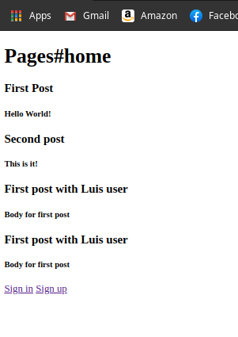
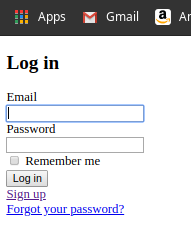
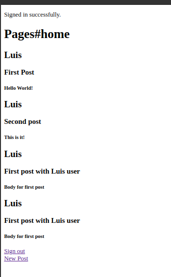

# members-only

In this project, we applied the knowledge acquired in the Authentication section of the curriculum. We used Devise gem to create an authentication environment for users and we used the scaffold method to create a complete MVC environment for the Posts. We used the previously acquired knowledge to manage the associations through Active Record, and finally, we displayed the logic to make the information about the posts appear or disappear for the user depending on whether he/she is authenticated or not.







# Requirements

- Ruby > 2.6.5
- Rails > 6.0.3

## Getting Started

To get started with the app, cd to the directory where you would like the repo to live by typing on your terminal:

```
$ cd <directory>
```

Clone the repo typing:

```
$ git clone git@github.com:shubham14p3/members-only.git
```

Install the needed gems:

```
$ bundle install
```

Finally, migrate the database:

```
$ rails db:migrate
```

## Built With

- Ruby
- Rails
- VSCode
- Devise

## Authors

👤 **Luis Angel Maldonado**

- Github: [@lmaldonadoch](https://github.com/lmaldonadoch)
- Twitter: [@LuisAngelMCh](https://twitter.com/LuisAngelMCh)
- Linkedin: [linkedin](https://www.linkedin.com/in/lmaldonadoch)

👤 **Shubham Raj**

- Github: [@ShubhamRaj](https://github.com/shubham14p3)
- Linkedin: [Shubham14p3](https://www.linkedin.com/in/shubham14p3/)

## 🤝 Contributing

Contributions, issues and feature requests are welcome!

Feel free to check the [issues page](https://github.com/shubham14p3/micro_reddit/issues/).

## Acknowledgement

- Project requested by [Microverse Program](https://www.microverse.org/).
- Original project from [The Odin Project](https://www.theodinproject.com/courses/ruby-on-rails/lessons/forms).

## Show your support

Give a ⭐️ if you like this project!
